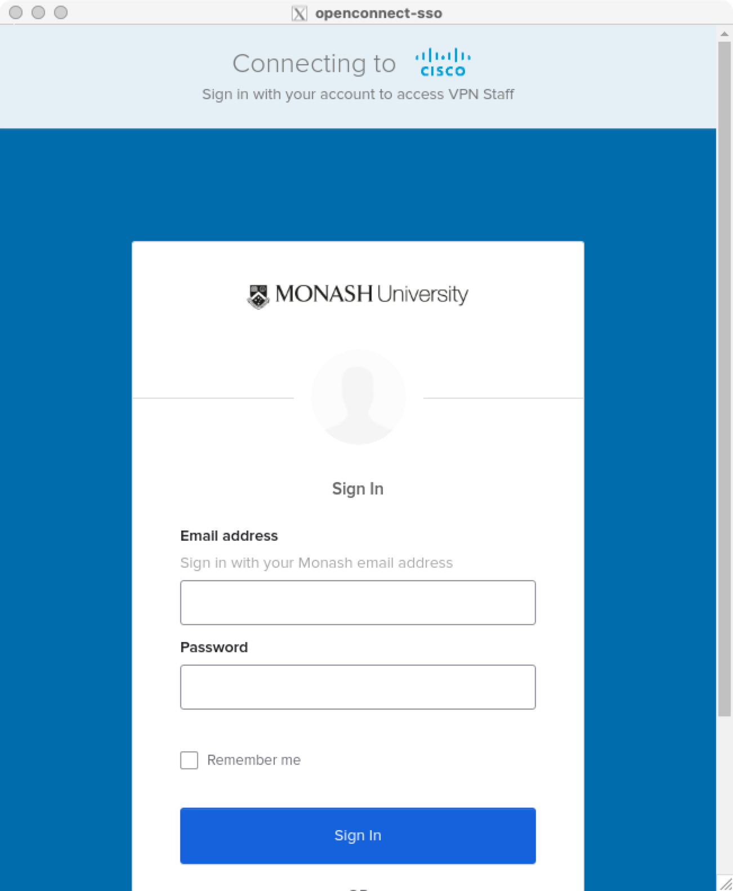
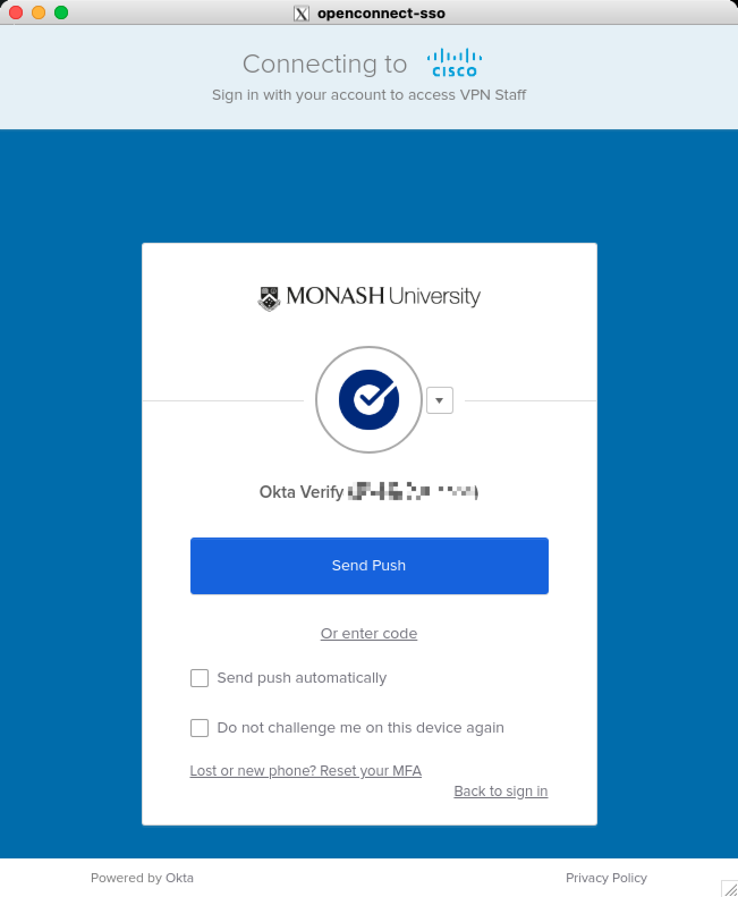

# Docker-openconnect-sso

Run your own Anyconnect VPN client with SSO in Docker. VPN is running in the container, and a socks5 proxy is exposed to the host machine.

# Run

1. Set up the X11 server on your host machine.
* [Windows](https://sourceforge.net/projects/vcxsrv/)
* [MAC](https://www.xquartz.org/)
> Note: For mac users, please run the following command to allow connections from network clients.
```bash
xhost +
```

2. Run the following command to start the container. 

Please replace the SERVER_NAME and USER_NAME with your own.
```bash
docker run -itd --privileged --name=anyconnect-sso-x11 -v /dev/shm:/dev/shm -v /tmp/.X11-unix:/tmp/.X11-unix -e SERVER_NAME=${SERVER_NAME} -e USER_NAME=${USER_NAME} -e DISPLAY=host.docker.internal:0.0 -p 127.0.0.1:10081:1080 --restart=unless-stopped rmanluo/openconnect-sso-x11:latest
```
## Example:
```bash
docker run -itd --privileged --name=anyconnect-sso-x11 -v /dev/shm:/dev/shm -v /tmp/.X11-unix:/tmp/.X11-unix -e SERVER_NAME=vpn.xx.edu -e USER_NAME=xxx@xx.edu -e DISPLAY=host.docker.internal:0.0 -p 127.0.0.1:10081:1080 --restart=unless-stopped rmanluo/openconnect-sso-x11:latest
```

1. Input your login information in the pop-up window.
> Note: If no windows are displayed, please check if X11 on your host machine is properly set up.   


2. Complete the 2FA authentication.   


It will open a socks5 proxy on port 10081 on your host machine. You can use it with your browser or other tools.


# Build the Image

```bash
docker build -t openconnect-sso-x11 .
```
# TODO
* [ ] Add VNC support.

# Thanks
* [openconnect-sso](https://github.com/vlaci/openconnect-sso)
* [openconnect](https://www.infradead.org/openconnect/)
